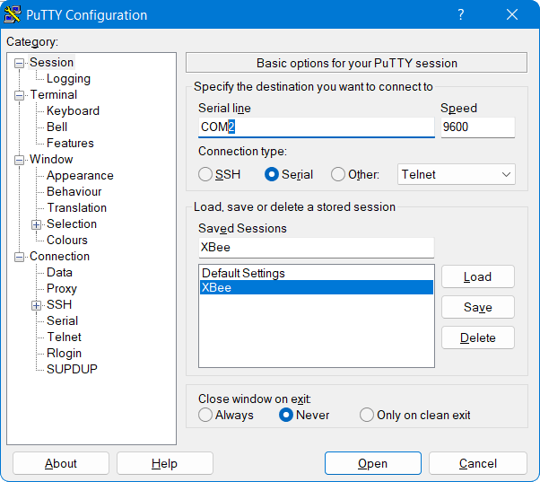

# Lab 3: communication

In this lab you will build FlatSAT's communication system including the onboard radio, antenna, and ground station, to ensure FlatSAT has sufficient link margin to communicate from orbit. You will test communication and measure signal strength at multiple link distances to characterize the link budget. 

In this lab one laptop will serve as FlatSAT's ground station. The ground station computer will send commands to the spacecraft over an XBee serial link using the `PuTTYPortable` terminal program found in `computer_environment/PuTTYPortable/`

One laptop will be used to power FlatSAT. 

## documentation

- Arduino MKR Zero pinout

## software

- Arduino IDE
  
  - `lab_03_communication.ino`
- PuTTYPortable terminal

## hardware

* ESD-safe grounding straps
* FlatSAT
  
  * SparkFun XBee explorer with mounted XBee radio
* SparkFun XBee explorer dongle 
* antennas (small and large)
* LED and resistor

## setup

Wear your ESD bracelet

- connect XBee radio (top left of diagram)
  - 3.3 V power, ground, transmit, receive

- Add LED and resistor shown next to XBee radio
  - LEDs are directional—short leg of LED connects to ground through resistor
  - LEDs are sensitive and will burn out without a resistor


### XBee breakout

The XBee radio communicates with Arduino using serial communication. Serial communication uses two wires: transmit and receive. 


Connect serial lines

- XBee 3 (DOUT) -> Arduino D13 (RX)
- XBee 4 (DIN) -> Arduino D14 (TX) 

## Channel selection

Select a channel number (PAN ID) between 0 and 9999. You will program this channel on both ends of your radio link. It must be different than the channel selected by other groups. Write down your channel number for reference. 


## Program FlatSAT

- Connect FlatSAT to a PC with Arduino IDE installed
- Open `lab_03_communication.ino`
- From the tools menu, select the correct board (MKR Zero) and port
- In `lab_03_ communication.ino`, modify this line with your selected channel number (PAN ID)

```
// channel for XBee communication
// select a number between 0 and 999
int PAN_ID = 2006; 
```


- Upload the file to the Arduino. You should see the LED labelled “L” on the Arduino board blink three times in rapid succession when the upload completes. You will also get a message in the black dialog box at the bottom of the IDE window. If you have any errors uploading, double check that you have the correct board and port selected.


## Setup the ground station

- If your FlatSat radio has an RP-SMA connector, attach a small antenna to it.


- Connect the XBee explorer to your ground station PC via USB

- If you don't already have the serial port number of your ground station antenna (COMXX), find it from device manager

  - Open Device Manager on the lab station PC, and click on “Ports.” Note which port number is assigned to your ground antenna.

  

- open `computer_environment/PuTTYPortable/PuTTYPortable.exe`

- select the *XBee* saved session and click *Load*

- In the Serial line box, change the number (the 2 at the end of COM2) to the port number of you found in Device Manager



- click open

- type the following commands (press enter, but do not type other words in parentheses)

```
(wait 1 second)
+++ (do not type enter)
(wait for XBee to return "OK")
ATID (your channel number) (enter)
ATID (enter) (verify correct channel) 
ATDH 0 (enter)
ATDL 1 (enter)
ATMY 0 (enter)
ATWR (enter)
ATCN (enter)
```


## test link

FlatSAT and the ground station should now be connected and communicating. Restart FlatSAT (the small blue button on the Arduino). The terminal on the ground station PC should display a welcome message. If not, restart `PuTTYPortable` and FlatSAT. 

If the link doesn’t work, connect to FlatSAT with the serial monitor and look for error messages. 

(You should start to see messages from Arduino. If they end with “ Received: OK and 0 0” then you are good to go. If the messages continue to autoscroll without stopping, you will need to disconnect your USB cable from your laptop and close the serial monitor. Then you will need to re-connect the USB cable to your laptop and re-open the serial monitor. If you do not get the “OK” message in the serial monitor the second time, double-check that you connected all of the wires correctly.)


## Sending and Receiving Data

FlatSAT can perform the following options. 

```
1 help
2 get RSSI
3 toggle LED
```

- Type 3 to toggle the LED. 
- Type 2 to get XBee’s current RSSI. 
- collect RSSI values at the following distances

| distance (m) | RSSI (dB) |
| ------------ | --------- |
| 0.5          |           |
| 1            |           |
| 2            |           |
| 5            |           |

At each distance, also toggle the LED. 

Next, repeat the RSSI measurement at 5 m with a different size antenna. Record this RSSI value and the antenna change. 

Finally, see how far FlatSAT can communicate. If you go outside, call your teammate on the telephone to establish side channel communication. Record your RSSI at distance and use https://gmap-pedometer.com/ to determine your separation. 


## Lab station cleanup

- Disconnect devices from all computers
- Remove the ESD wrist straps and replace them in the bag at your lab station.
- Replace all items at your lab station the way you found them. 
- Have your instructor check off your lab station before you depart.
